# 웹 애플리케이션 개요

## 1. 🚀 프로젝트 이름

- Ezen Book Store

## 2. 📖 프로젝트 개요

- **목적**: 기업 요구사항에 맞춘 온라인 서점 시스템 개발 및 포트폴리오 활용
- **주요 목표**:
  - 사용자 계정 관리, 상품 관리, 결제 및 적립금 시스템 구현
  - 간결하고 직관적인 디자인 제공

## 3. 🔧 기술 스택

웹 애플리케이션을 개발하는 데 사용된 기술을 설명합니다.

- **개발도구**: VS Code, IntelliJ
- **프론트엔드**: HTML, CSS, JavaScript, Bootstrap
- **백엔드**: Spring Boot, Spring Security, JPA, JavaScript
- **데이터베이스**: MySQL, Amazon Web Service RDS
- **협업 도구**: GitHub
- **기타 도구**: Jenkins(CI/CD), Git(VCS), AWS(Server)

## 4. 👥 참여자 및 역할

- **김태현**:
  - 페이지
- **채윤성**:
  - 페이지
- **이정인**:
  - 페이지
- **정재환**:
  - 페이지
- **황예주**:
  - 페이지

## 5. 📜 주요 기능 설명

### 사용자 페이지

- **회원가입 및 로그인**
  - 일반 회원가입 및 간편 로그인 지원
- **내 정보 수정**
- **장바구니**
- **구매 기록 조회**
- **적립금 시스템**
  - 상품 구매 및 이벤트 참여 시 적립금 지급
  - 일정 적립금 이상 시 구매에 사용 가능

### 관리자 페이지

- **상품 등록 및 관리**
- **게시판 등록 및 관리**
- **배송비 시스템**
  - 일정 가격 이상 주문 시 배송비 감면
- **결제 및 조회**
  - 결제 대행 API(KG 이니시스 등) 활용

### 추가 기능

- **검색 기능** :
  - 통합 검색, 제목/저자 검색 등
- **상품 설명** :
  - 상세한 상품 옵션 및 설명 제공
- **공지사항 및 이벤트 페이지** :
- **고객센터** :
  - Q&A, 문의하기
- **아이디/비밀번호 찾기** :
- **화면 네비게이션** :
  - 상단 이동 버튼

## 6. 아키텍처 다이어그램

- **아키텍처 다이어그램 (?)**: ?

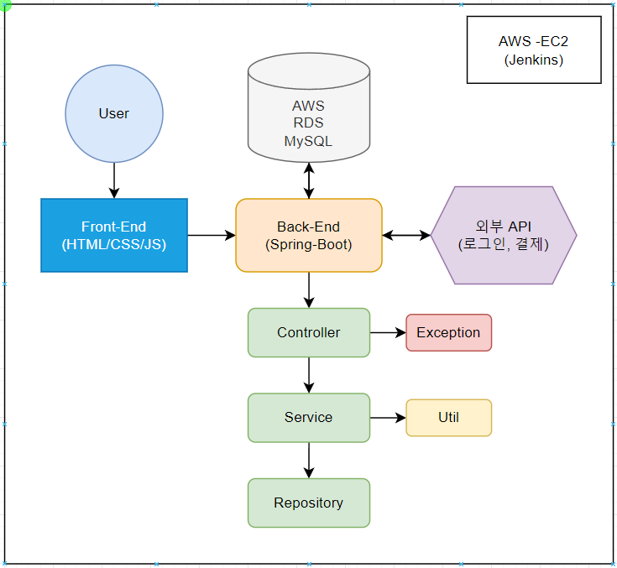

- **아키텍처 다이어그램 (?)**: ?

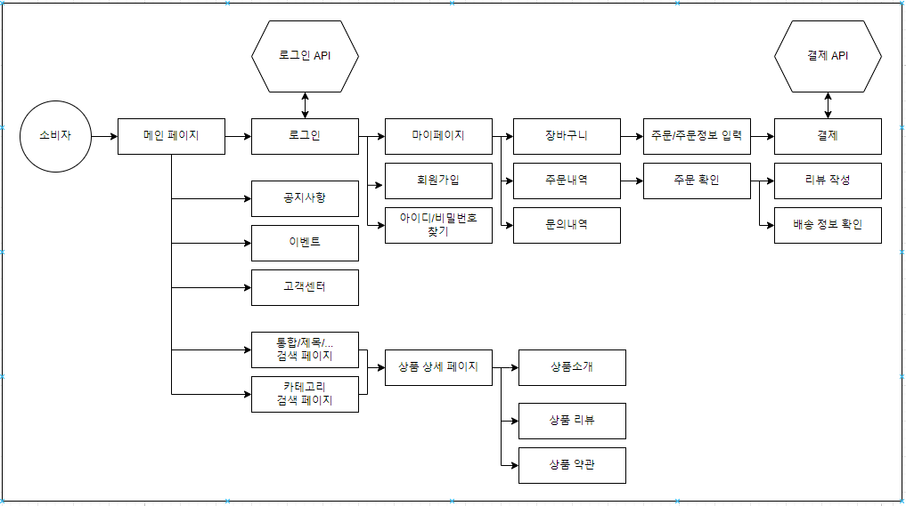

## 7. 화면 예시

- **메인 페이지**: 사용자가 처음 접속하면 출력되는 페이지

  

- **상품 메인 페이지**: 카테고리별 또는 검색을 통해 상품을 볼 수 있는 상품 메인 페이지

  

- **상품 디테일 페이지**: 상품 클릭시 상품의 상세정보를 볼 수 있는 상품 디테일 페이지

  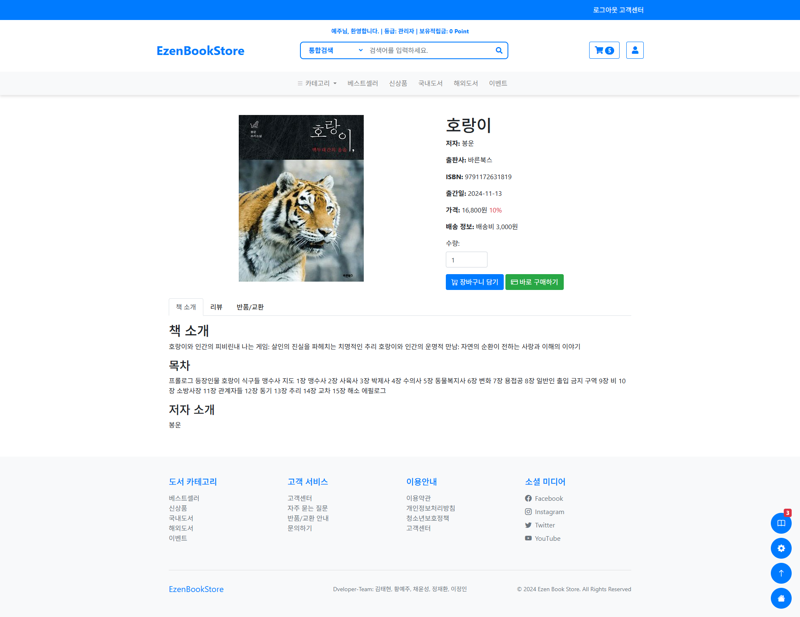

- **회원가입 페이지**: 회원가입을 할 수 있는 페이지

  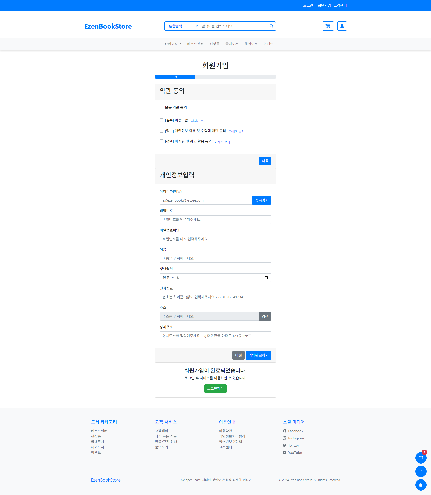

- **로그인 페이지**: 회원가입 후 로그인 또는 간편 소셜로그인을 할 수 있는 페이지

  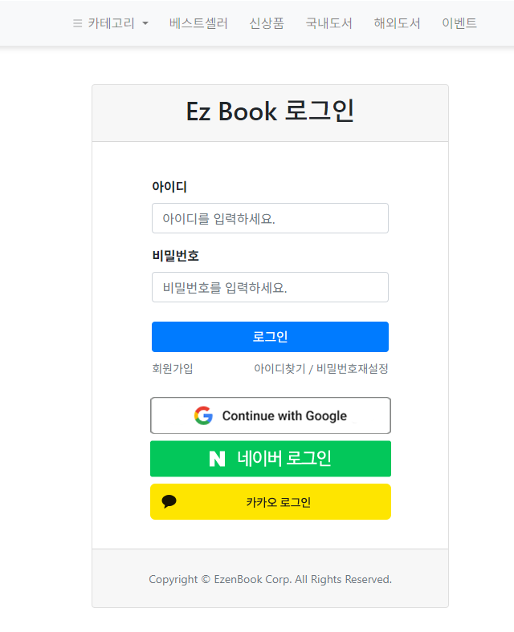

- **마이페이지 - 나의 정보**: 가입한 정보를 확인하고 수정할 수 있는 페이지

  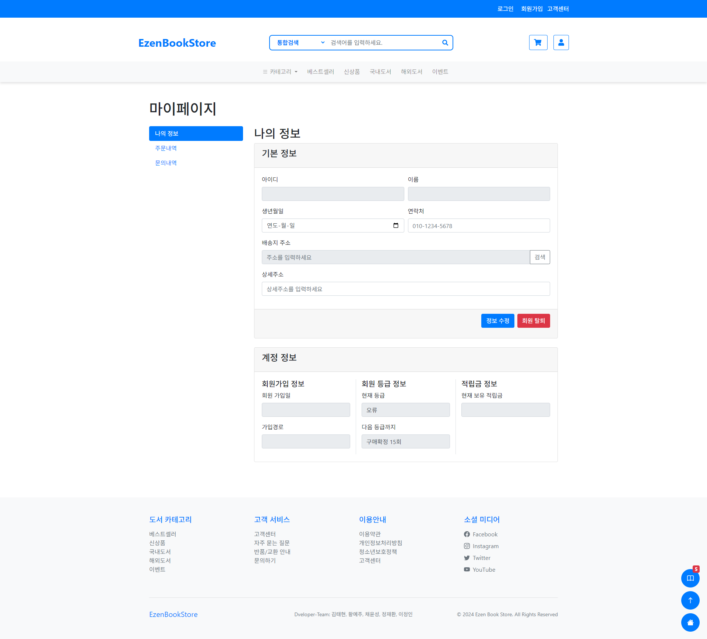

- **장바구니 페이지**: 담은 상품을 확인하고 구매할 수 있는 페이지

  

- **주문 확인 모달**: 주문하기 전 정보를 확인하고 구매할 수 있는 모달창

  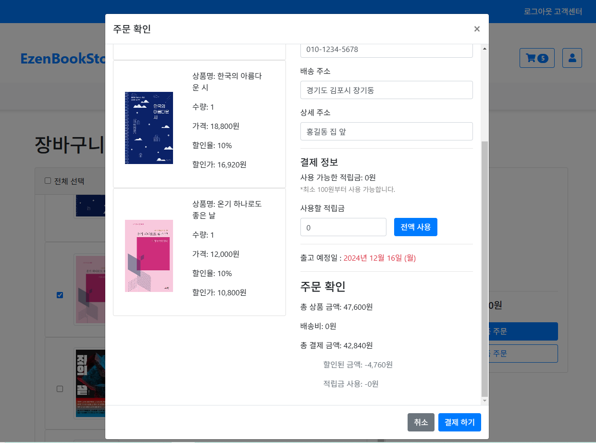

- **PG연동 모달**: 결제시 PG사 연동하여 결제할 수 있는 모달창

  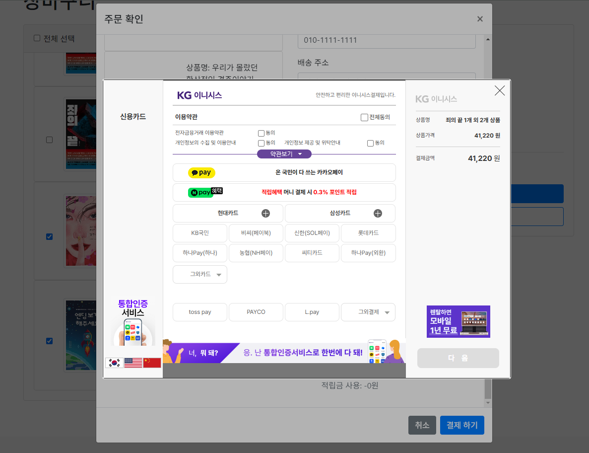

- **마이페이지 - 주문내역**: 주문한 정보를 확인할 수 있는 페이지

  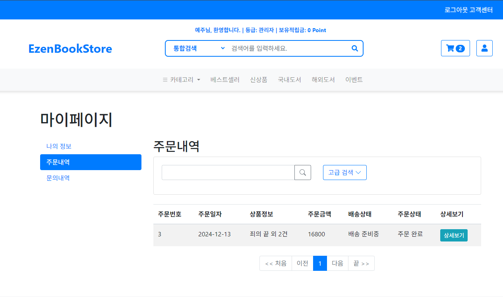

- **주문내역 상세 모달**: 주문내역을 상세하게 확인할 수 있는 페이지

  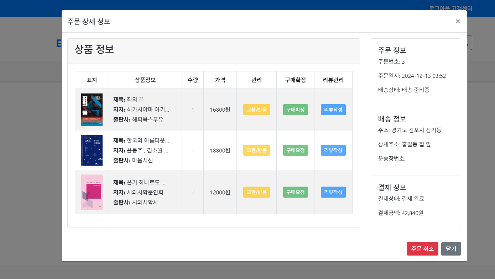

- **관리자 페이지 - 대시보드**: 관리자페이지에 처음 접속하면 한 눈에 확인하고 관리할 수 있는 페이지

  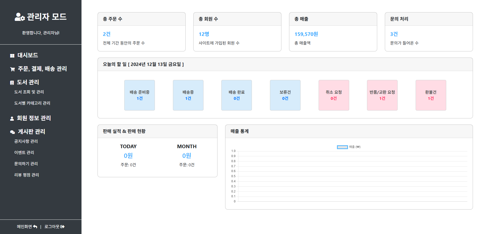

- **관리자 페이지 - 상품 관리 페이지**: 상품을 등록하고 조회, 관리할 수 있는 페이지

  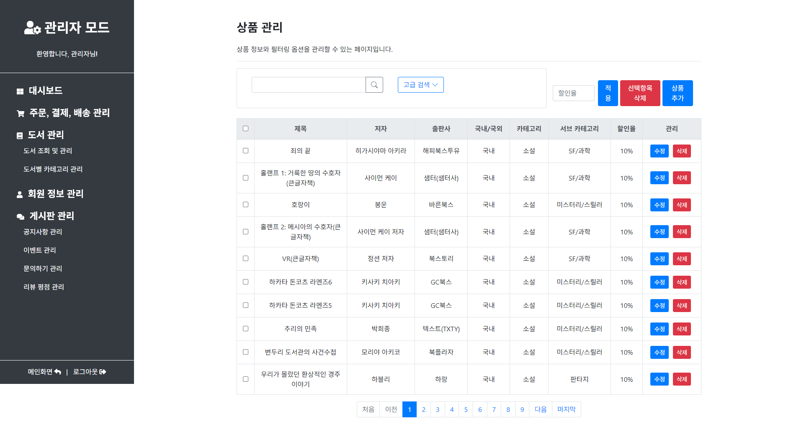

- **관리자 페이지 - 이벤트 관리 페이지**: 이벤트를 등록하거나 관리할 수 있는 페이지

  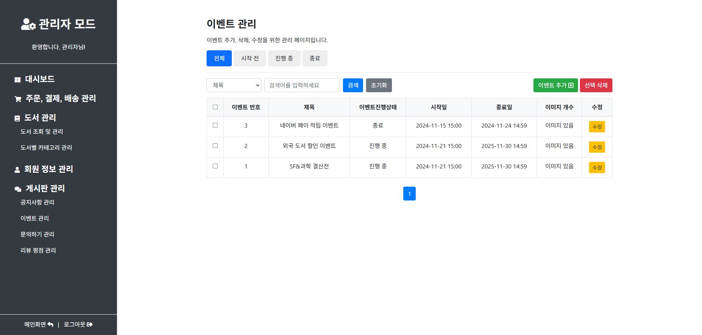

- **이벤트 추가 모달**: 이벤트를 추가할 수 있는 모달창

  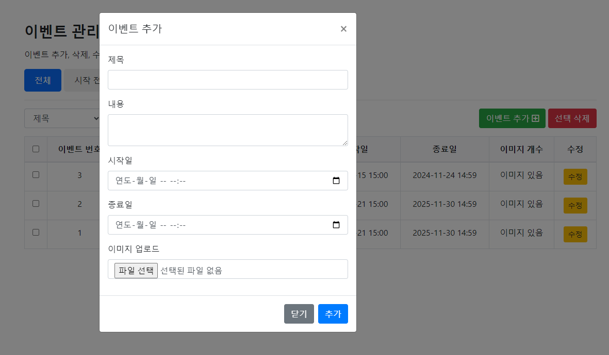

- **디테일 버튼**: 홈으로 돌아가기 / 상단으로 이동 / 관리자모드 / 최근 본 상품목록 버튼

  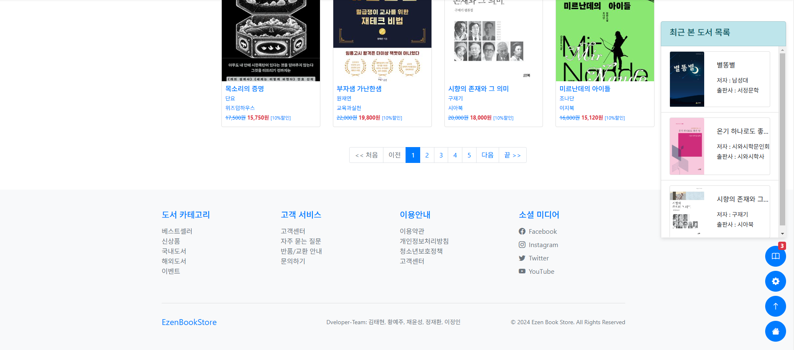

## 8. 📅 참고 사이트

- [교보 문고](https://www.kyobobook.co.kr/) : UI 참고
- [예스24](https://www.yes24.com/main/default.aspx) : 참고
- [바로보네](https://www.barovone.com/kr/index/index.lime) : 참고
- [반디앤루디스](https://www.bandinlunis.com/front/main.do) : 참고
- [알라딘](https://www.aladin.co.kr/home/welcome.aspx) : 참고

---

## 부록

- **참조 문서**:
  - 협업 문서 관리 : [GoogleSheets](https://docs.google.com/spreadsheets/d/1ABl90LxOWC4B3PIknlzmOfYaD1EMgwfHcxZY2cWX2GE/edit?gid=244139402#gid=244139402)
- **연락처**:
  - 김태현 : [Email](mailto:qsdcv301@naver.com), [GitHub](https://github.com/qsdcv301)
  - 채윤성 : [Email](mailto:gksmsk5094@gmail.com), [GitHub](https://github.com/ChaiTope)
  - 이정인 : [Email](mailto:), [GitHub](https://github.com/LEE-JUNGIN)
  - 정재환 : [Email](mailto:jjjhhh2569@gmail.com), [GitHub](https://github.com/JaeHwan2569)
  - 황예주 : [Email](mailto:jooland05@gmail.com), [GitHub](https://github.com/HwangYeJoo)
